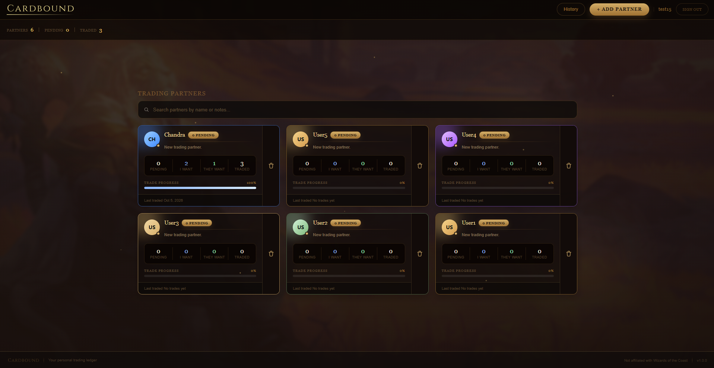
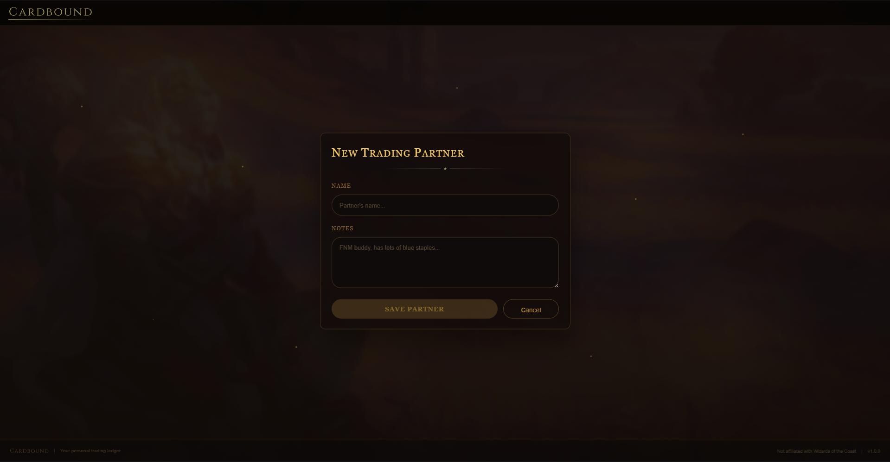
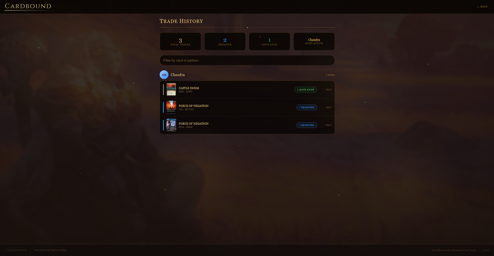
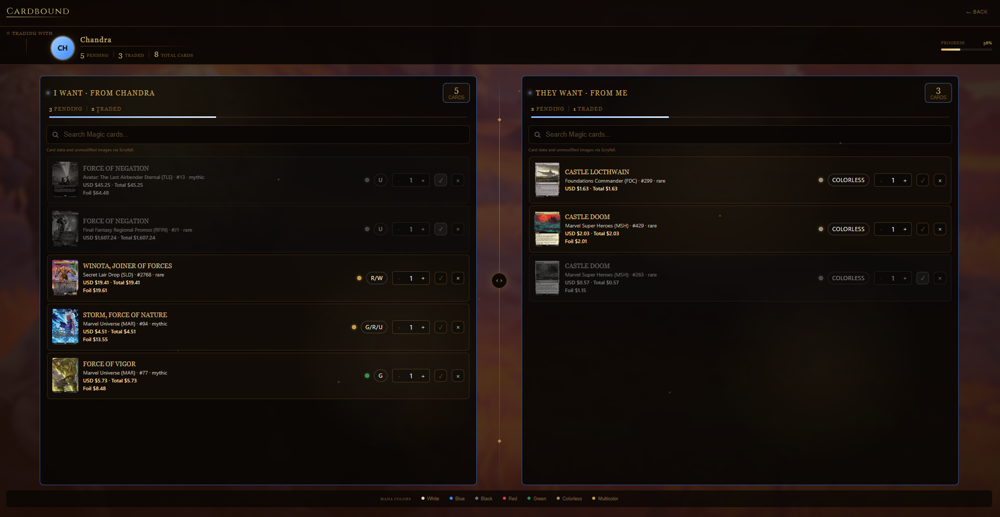

# Cardbound

Cardbound is a mobile- and desktop-friendly trading ledger for Magic: The Gathering players who want to organize cards they want from partners, cards they can offer, and completed trades.

- **Live site:** [GitHub Pages](https://seramoera.github.io/cardbound-trading-ledger/)
- **Backend:** Supabase Auth, Postgres, and its client-facing API. No separate Express API is used by the app.
- **Demo video:** Not published yet.


## What it does

- Create an account and sign in with Supabase Auth.
- Add trading partners, with notes and partner-specific colors.
- Search Scryfall for cards and add them to either side of a partner's trade inventory.
- Adjust quantities, mark cards as traded, and remove cards.
- Review completed trades in trade history.
- Use a responsive desktop and mobile interface; mobile trade inventories use tabs and compact card controls.
- Persist partners and trade-card state in Supabase so the same account data is used across devices and viewport sizes.

## Built with

- React 18 and Vite.
- Supabase Auth, Postgres, Row Level Security, and `@supabase/supabase-js` for accounts and persistent data.
- Scryfall API for card search, card data, and unmodified card images.
- GitHub Actions and GitHub Pages for the static client deployment.

## How it works

The browser client authenticates users with Supabase and accesses the `profiles`, `partners`, and `trade_history` tables through Supabase's API. Row Level Security policies scope partner and trade data to the signed-in owner. Card search requests go to Scryfall. GitHub Pages hosts the static client; the Express/PostgreSQL sightings service in `server/` is starter code and is not part of the live Cardbound data path.

## Setup

### Requirements

- Node.js 20 or newer and npm.
- A Supabase project with the Cardbound tables, auth trigger, RLS policies, and `is_username_available` RPC configured.

### Run locally

```powershell
git clone https://github.com/seramoera/cardbound-trading-ledger.git
cd cardbound-trading-ledger/client
npm ci
Copy-Item .env.example .env
```

Set these values in `client/.env` using your Supabase project's API settings:

```env
VITE_SUPABASE_URL=https://your-project-ref.supabase.co
VITE_SUPABASE_ANON_KEY=your-public-anon-key
```

Then start the client:

```powershell
npm run dev
```

Open `http://localhost:5173`. The anon key is public client configuration; never use a Supabase service-role key in the client. Keep RLS enabled.

### Supabase database setup

The app requires `profiles` and `partners` tables plus the `handle_new_user` auth trigger. After those exist, run [`docs/supabase-trade-history.sql`](docs/supabase-trade-history.sql) to create the trade inventory table. For an existing project that needs access hardening, run [`docs/supabase-anon-access-fix.sql`](docs/supabase-anon-access-fix.sql); it replaces policies, revokes anonymous table access, grants the app's required authenticated operations, and creates the username-availability RPC.

## Deploying

The GitHub Pages workflow is [`.github/workflows/deploy-pages.yml`](.github/workflows/deploy-pages.yml). Configure **Settings → Pages → Build and deployment → Source: GitHub Actions**, then add `VITE_SUPABASE_URL` and `VITE_SUPABASE_ANON_KEY` as repository Actions variables. Run **Actions → Deploy client to GitHub Pages → Run workflow** after changing those variables.

The expected Pages address is `https://seramoera.github.io/cardbound-trading-ledger/`. Supabase is the app's hosted backend; there is no separate API host or `CORS_ORIGINS` setting needed for the active client path.

## Project Structure

```text
Cardbound/
├── .github/workflows/          # GitHub Pages deployment workflow
├── client/                     # React and Vite application
│   └── src/
│       ├── App.jsx             # Screens, auth flow, partner and trade behavior
│       ├── lib/supabase.js     # Supabase client and auth-session setup
│       ├── styles.css          # Desktop and mobile presentation
│       └── assets/             # Logos, card UI art, and backgrounds
├── docs/
│   ├── assets/                 # App screenshots
│   ├── supabase-trade-history.sql
│   └── supabase-anon-access-fix.sql
├── server/                     
└── README.md
```

## Architecture

The React/Vite client is built and hosted as static files on GitHub Pages. In the browser, `client/src/lib/supabase.js` creates the Supabase client; Supabase Auth manages accounts, and the client-facing Supabase API reads and writes the `profiles`, `partners`, and `trade_history` tables. Row Level Security scopes those records to the signed-in user. Card search requests go from the browser to Scryfall. 

## Screenshots








## Third-party attribution

- Card data and unmodified card images are provided through the [Scryfall API](https://scryfall.com/docs/api).
- The Chandra and Ajani background artwork in `client/src/assets/chandra_bg.jpg` and `client/src/assets/ajani_bg.svg` features characters owned by Wizards of the Coast LLC. Magic: The Gathering and its characters are trademarks of Wizards of the Coast. Cardbound is an independent educational project and is not affiliated with or endorsed by Wizards of the Coast. Attribution does not itself grant a license.

## What I would do next

- Consolidate the first-time Supabase schema for profiles, partners, and the auth trigger into a checked-in SQL setup file.
- Verify the deployed Pages build after configuring the Actions variables, and test account signup and trade persistence on the live site.
- Finish documenting asset permissions and confirm every bundled background image is approved for this use.

## Author

[seramoera](https://github.com/seramoera).
4APSI CS-402

## AI use


I used GitHub Copilot Chat for app design and implementation support, Supabase and Scryfall integration, responsive mobile work, and deployment/security troubleshooting. The detailed prompt, correction, and authorship record is in [`AI-USAGE.md`](AI-USAGE.md).

## Security

See [`SECURITY-CHECKLIST.md`](SECURITY-CHECKLIST.md) for the current audit and remaining verification items. Never commit `.env` files or use the Supabase service-role key in browser code.

## License

See [`LICENSE`](LICENSE).
